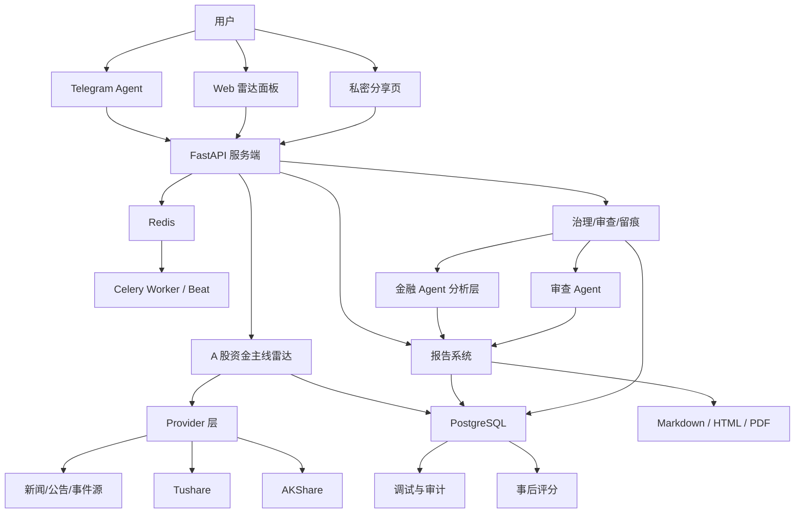

# BaizeFinDB 项目开发总文档

版本：v0.4  
更新日期：2026-04-30  
状态：M3.2 雷达核心早期  
适用对象：个人使用、vibe coding 开发、AI 协作接手

## 1. 当前结论

BaizeFinDB 是一个面向个人的 AI 金融雷达与投研辅助系统，不是交易系统，也不是金融终端复刻。

核心形态：

> A 股资金主线雷达 + 事件驱动投研 + 证据链审查 + Telegram/Web 交互 + 日报周报 + 事后评分。

当前技术路线：

- 主工程自建，不 fork FinceptTerminal、OpenBB、FinSight 这类大仓库。
- MVP 用轻量 Python 服务端打底：FastAPI + PostgreSQL + Redis + Celery + Provider 抽象。
- 数据先接 AKShare，Tushare 作为更稳定的补充源。
- AI 负责解释、补证据、审查和生成报告，不直接决定雷达等级。
- edict 的“三省六部制”只吸收治理思想，按金融场景重写轻量版。
- Qlib、Prefect、GraphRAG、Neo4j、完整回测系统都放到 MVP 之后。

截至 2026-04-30，工程已经完成 M1、M2 早期闭环，并推进到 M3.2：

- M1：后端工程骨架、配置、健康检查、Alembic、Docker Compose、pytest 已完成。
- M2：AKShare 最小 Provider、采集日志、快照、质量检查、Provider 查询 API 已完成。
- M3：雷达扫描批次、候选信号、证据链、P0/P1/P2 初判、生命周期初判已完成。
- M3.2：同一板块/概念的连续扫描记忆、连续 P1 快报候选标记、生命周期转移记录、`golden_cases` 规则样例已完成。
- 未开始：Agent 审查、Telegram、报告、Web、日报周报、评分系统。

一句话：先做一个可运行、可审查、可复盘的个人金融雷达服务，不要一开始背上金融终端、量化平台、交易框架的重量。

## 2. 产品边界

### 2.1 要解决的问题

系统帮助用户更快发现：

- A 股市场资金主线；
- 板块、概念、主题异动；
- 龙头、容量票、连板梯队变化；
- 新闻、政策、公告、产业事件催化；
- 持仓和自选可能受到的影响；
- 风险事件和退潮信号；
- 事后判断是否有效。

系统输出的是投研辅助信息：

- 观察建议；
- 关注优先级；
- 条件性轻度建议；
- 风险提示；
- 后续确认条件；
- 无效条件；
- 证据链；
- AI 分歧意见；
- 事后评分。

### 2.2 第一阶段不做

- 自动交易、自动下单、券商交易权限接入；
- 保存券商交易密码；
- 秒级高频盘口和高频交易；
- 强买卖指令和保证收益类结论；
- 复杂多租户 SaaS；
- 全量研报库；
- 完整产业链知识图谱；
- 完整历史回测系统；
- 全市场全股票深度分析。

禁止输出这些口径：

- 必涨；
- 必买；
- 稳赚；
- 满仓；
- 无脑上；
- 保证收益；
- 照单交易。

默认免责声明：

> 系统内容仅供个人研究和复盘，不构成投资建议，不保证收益，用户需要自行决策并承担风险。

## 3. 产品原则

### 3.1 规则定级

雷达等级由规则引擎判定。AI 可以解释、补证据、指出风险、建议关注等级，但不能绕过规则直接把信号定成 P0/P1/P2。

### 3.2 证据优先

每个信号必须能回答：

- 为什么触发；
- 数据来自哪里；
- 哪个规则触发；
- 哪个 Agent 参与；
- 审查为什么通过、降级或封驳；
- 为什么推送或没推送；
- 事后表现如何。

### 3.3 审查兜底

以下内容必须经过审查：

- P0 信号；
- 连续 P1 信号；
- 风险信号；
- 持仓/自选相关信号；
- 即将发布的报告；
- 公开分享页。

审查 Agent 只能用硬理由阻止自动发布：

- 数据异常；
- 证据冲突；
- 来源过期；
- 映射错误；
- 重复触发；
- 规则矛盾；
- 保证性结论；
- 诱导交易语言；
- 分享页未脱敏或未脱源。

### 3.4 先闭环，后增强

MVP 优先跑通这个闭环：

1. 数据采集；
2. 规则扫描；
3. 信号生成；
4. 审查；
5. Telegram 推送；
6. 报告生成；
7. Web 查看；
8. 日报周报；
9. 事后评分；
10. 调试复盘。

## 4. 技术路线

### 4.1 推荐技术栈

| 层级 | 推荐选择 | 说明 |
| --- | --- | --- |
| 后端 | Python + FastAPI | 轻量，适合 API 和 Agent 工具化 |
| 数据校验 | Pydantic v2 | 统一请求、响应、Provider、Agent 输出结构 |
| 数据库 | PostgreSQL | 存信号、证据、报告、日志、评分 |
| ORM/迁移 | SQLAlchemy 2.0 + Alembic | 稳定，迁移清楚 |
| 缓存/队列 | Redis | Celery broker/result、短期状态、去重 |
| 后台任务 | Celery + Celery Beat | 定时扫描、报告任务、推送任务 |
| 前端 | Next.js + TypeScript | Web 雷达面板、信号详情、报告页、分享页 |
| 样式 | Tailwind CSS + 组件库 | 快速做可用后台界面 |
| 数据源 | AKShare + Tushare | A 股 MVP 数据底座 |
| 报告 | Markdown/HTML 优先 | PDF 和 Quarto 放到后面 |
| 部署 | Docker Compose | 适合个人服务器 |
| LLM | 结构化工具调用 + 模型路由 | 先自建轻量 Agent 编排 |

### 4.2 建议目录

```text
backend/
  app/
    api/
    core/
    db/
    providers/
    radar/
    evidence/
    agents/
    governance/
    reports/
    telegram/
    portfolios/
    scoring/
    tasks/
    audit/
    debug/
frontend/
  app/
  components/
  lib/
  styles/
infra/
  docker/
  scripts/
docs/
  decisions/
  runbooks/
  specs/
```

### 4.3 总体架构



## 5. 核心模块

### 5.1 Provider 层

Provider 层负责把不同数据源变成统一结构，业务逻辑不能直接调用 AKShare 或 Tushare。

第一阶段 Provider：

- `MarketDataProvider`：指数、个股涨跌幅、成交额、换手率；
- `SectorDataProvider`：行业、概念、主题、板块；
- `LimitUpProvider`：涨停、跌停、连板、炸板；
- `NewsProvider`：新闻、快讯、事件；
- `AnnouncementProvider`：公告、监管、交易所公告；
- `FundamentalProvider`：财务、估值、基础资料。

每次拉取记录：

- provider；
- fetch_time；
- source_time；
- success/failure；
- error_message；
- freshness；
- confidence；
- missing_fields；
- raw_snapshot_id；
- normalization_version。

MVP 策略：

1. 先接 AKShare 的最小行情、板块、概念、涨跌幅接口。
2. 每个接口先用脚本验证，再封装 Provider。
3. 原始响应保留 snapshot 或摘要，方便调试。
4. 数据缺失不让系统崩溃，而是打质量标签。
5. Tushare 先预留 token 和 Provider 壳，再补财务/公告。

### 5.2 雷达引擎

雷达每 5 分钟扫描一次，第一版只做 A 股。

扫描流程：

1. 创建 `radar_scan_batch`；
2. 拉取板块/概念/个股异动数据；
3. 计算板块联动、资金代理指标和市场情绪；
4. 聚合新闻、公告、政策、产业事件；
5. 生成候选信号；
6. 规则判定 P0/P1/P2；
7. 判定生命周期；
8. 写入证据和信号路径；
9. 触发审查、推送和报告任务。

等级规则：

| 等级 | 含义 | 触发口径 |
| --- | --- | --- |
| P0 | 强主线 / 重大风险 | 主线 P0 必须有资金或市场联动确认；风险 P0 可以由重大公告、监管或黑天鹅单独触发。 |
| P1 | 疑似点火 / 值得观察 | 有资金或情绪信号，但证据还不完整。连续 3 次 P1 或 30 分钟 3 次 P1 触发快报。 |
| P2 | 弱信号 / 记录观察 | 单点异动、新闻待验证、联动不足、数据缺失、噪音概率较高。 |

生命周期：

- 点火；
- 发酵；
- 分歧；
- 回流；
- 高潮；
- 退潮；
- 熄火。

持仓和自选只影响个人提醒优先级，不改变市场主线等级。

### 5.3 证据链与分享安全

证据字段：

- evidence_id；
- signal_id；
- evidence_type；
- source_name；
- source_url；
- source_time；
- collected_at；
- raw_excerpt；
- normalized_summary；
- confidence；
- freshness；
- copyright_visibility；
- public_share_policy。

公开分享页默认脱源、脱敏：

- 不展示原始 URL；
- 不展示源网站域名；
- 不展示大段原文；
- 不展示持仓、成本价、仓位、个人备注；
- 不展示模型审查日志；
- 不展示内部证据链。

### 5.4 Agent 分析层

Agent 不决定雷达等级，只做解释和补充判断。

第一阶段 Agent：

- 市场数据分析员；
- 新闻/事件分析员；
- 基本面分析员；
- 行业/产业分析员；
- 多头研究员；
- 空头研究员；
- 风险评审员；
- 报告撰写员；
- 审查/封驳员。

Agent 输出必须结构化：

- summary；
- supporting_evidence；
- conflicting_evidence；
- risks；
- missing_data；
- suggested_attention_level；
- confidence；
- needs_human_review。

建议等级使用非交易口径：

- 重点关注；
- 继续观察；
- 谨慎跟踪；
- 暂不关注；
- 风险回避。

### 5.5 治理层

治理层的目标是限制 Agent 权力，让每个动作可追溯。

| 治理职责 | 对应功能 |
| --- | --- |
| 规划 | 任务拆解、选择 Agent、选择工具 |
| 执行 | 调度 Provider、Agent、报告、推送 |
| 审查 | 检查证据、风险、诱导交易、版权 |
| 封驳 | 阻止不合格报告或降级信号 |
| 权限 | 区分低风险查询和高风险操作 |
| 审计 | 记录模型调用、工具调用、用户操作 |
| 留痕 | 每个信号、报告、推送都有可追溯路径 |

第一阶段用轻量状态机即可：

```text
created -> planned -> executed -> reviewed -> approved
                                      -> downgraded
                                      -> blocked
                                      -> needs_human_review
```

### 5.6 Telegram 与 Web

Telegram 是可对话入口，MVP 支持：

- 查询当前雷达；
- 查询 P0/P1/P2；
- 查询板块信号路径；
- 生成快报或标准报告；
- 添加临时关注、自选；
- 查询持仓影响；
- 查询日报、周报、审查结果；
- 获取报告链接。

高风险或高成本操作必须二次确认：

- 删除关注对象；
- 修改持仓成本或仓位比例；
- 关闭提醒；
- 批量操作；
- 触发高成本深度报告；
- 公开分享报告；
- 导出含个人数据的报告。

Web MVP 页面：

- 雷达总览页；
- 信号详情页；
- 持仓/自选管理页；
- 报告列表页；
- 报告详情页；
- 私密分享页；
- 调试/审计后台。

### 5.7 报告与评分

报告分三档：

- 快报：Telegram 快速查看；
- 标准报告：P0 自动报告默认档；
- 深度报告：用户手动触发。

自动生成：

- 日报；
- 周报；
- 事后评分报告；
- 分享页版本。

MVP 路线：

1. 先用 Markdown 模板生成快报和标准报告。
2. 再用 HTML 页面展示报告。
3. PDF 导出可先用浏览器打印，Quarto 后置。
4. 深度报告先预留字段，不急着上全量研报库。

## 6. 数据模型 MVP

核心数据表：

| 类别 | 表 |
| --- | --- |
| 用户与入口 | users、telegram_bindings |
| 标的与板块 | instruments、sectors、concepts |
| 数据采集 | market_snapshots、provider_fetch_logs、data_quality_checks |
| 雷达信号 | radar_scan_batches、radar_signals、signal_lifecycle_events |
| 证据链 | evidence_items |
| 个人关注 | portfolios、watchlists、focus_items |
| 报告 | reports、report_exports、report_reviews |
| Agent 与工具日志 | model_call_logs、agent_task_logs、tool_call_logs |
| 推送与审计 | push_logs、audit_events |
| 复盘评分 | score_records |
| 调试 | debug_cases |

核心信号字段：

- signal_id；
- scan_batch_id；
- market；
- sector/theme/concept；
- related_instruments；
- rule_level；
- ai_suggested_level；
- lifecycle_stage；
- trigger_rules；
- evidence_summary；
- data_quality；
- source_time；
- detected_at；
- is_portfolio_related；
- is_watchlist_related；
- push_status；
- report_status；
- review_status。

调试案例模板：

```text
debug_case_id:
问题类型:
发现时间:
关联 signal_id / report_id / task_id:
现象:
期望:
实际:
数据源状态:
触发规则:
Agent 输出:
审查结论:
根因:
修复方案:
回归测试:
是否写入文档/规则:
```

## 7. 开源项目取舍

正式引入代码前必须重新核对许可证、README、依赖和最新提交。

| 项目 | 当前判断 |
| --- | --- |
| AKShare | 可作为第一数据源，注意稳定性和数据质量标记。 |
| Tushare | 可作为补充数据源，token、权限和收费单独管理。 |
| OpenBB | 不作为底座，只学习 Provider、SDK、插件化、MCP 思路；核心代码不要复制。 |
| FinceptTerminal | 不作为底座，只参考终端体验；不要复制 UI trade dress 或核心代码。 |
| FinSight | 不直接引代码，只参考报告流水线。 |
| TradingAgents | 可参考角色分工和辩论流程，但交易口径必须改成观察/风险/证据不足。 |
| FinRobot | 可参考报告、估值、财务分析思路，不能继承交易策略口径。 |
| edict | 可吸收治理思想，建议按金融场景重写轻量版。 |
| Docling / Quarto | 报告解析和导出阶段再接入。 |
| Qlib / GraphRAG / Neo4j / vectorbt / backtrader | 不进 MVP，避免项目变成量化回测或图谱平台。 |

许可证原则：

- MIT / Apache-2.0 项目可以优先评估直接依赖或隔离吸收。
- AGPL / GPL 项目只参考思路，不复制核心代码。
- 涉及交易、券商接入、HFT 的能力不进入第一阶段。

## 8. MVP 路线

按个人 vibe coding 节奏推进，不按自然周死卡。每一阶段只追求可验收闭环。

| 阶段 | 目标 | 完成标准 |
| --- | --- | --- |
| M1 工程骨架 | 搭出可启动的最小服务端 | 已完成：FastAPI、PostgreSQL、Redis、Alembic、Docker Compose、`GET /health`、pytest 冒烟测试可用。 |
| M2 数据底座 | AKShare Provider 跑通 | 已完成早期闭环：行情/板块/概念数据可拉取、入库、记录质量标签；失败不拖垮主服务。 |
| M3 雷达核心 | 生成 P0/P1/P2 信号和生命周期 | 进行中，已到 M3.2：每次扫描可生成候选信号，能追溯数据批次、规则和证据，并记录连续扫描变化。 |
| M4 审查 Agent | 高优先级信号和报告发布前有审查 | P0、连续 P1、诱导交易语言、证据缺失都能被审查规则处理。 |
| M5 Telegram MVP | Telegram 成为可用入口 | 能查雷达、收 P0/P1 推送、查看快报，工具调用有日志。 |
| M6 报告闭环 | 快报、标准报告、分享页跑通 | 报告有版本、发布前审查，分享页不泄露原始 URL 和个人数据。 |
| M7 Web MVP | Web 能看雷达、详情、报告、调试 | 可查看 P0/P1/P2、信号详情、证据摘要、生命周期、报告和调试状态。 |
| M8 日报周报与评分 | 系统开始自我复盘 | 自动生成日报/周报，对 P0/P1 做 1/3/5/10 日表现记录。 |

已完成的工程节点：

1. 创建后端 MVP 骨架。
2. 建立 PostgreSQL、Redis、Alembic、健康检查。
3. 验证 AKShare 最小数据接口。
4. 写 Provider 抽象和拉取日志。
5. 建立 5 分钟采集任务。
6. 建立 Provider 状态、日志、快照查询 API。
7. 建立雷达扫描批次、候选信号、证据链基础表。
8. 建立 P0/P1/P2 初判、生命周期初判、连续 P1 快报候选标记。

最建议的下一步：

1. 做 M3.3 雷达总览 API：当前活跃信号、按优先级/板块聚合、去重视图。
2. 增加更多 `golden_cases`：强主线、误报、板块退潮、连续 P1 后转弱。
3. 准备 M4 轻量审查层：先用规则审查，不急着接复杂 Agent。

不建议现在做：

- fork FinceptTerminal；
- fork OpenBB；
- 上完整 Agent 框架；
- 做完整 Web 大屏；
- 做图谱；
- 做完整回测；
- 接自动交易。

## 9. 测试与质量门禁

### 9.1 测试重点

单元测试覆盖：

- Provider 标准化；
- 数据质量检查；
- P0/P1/P2 判定；
- 生命周期判定；
- 证据去重；
- 报告模板；
- 审查规则；
- 分享页脱敏；
- 权限和二次确认。

集成测试覆盖：

- Provider 拉取到入库；
- 扫描任务到信号生成；
- 信号到审查；
- 审查到推送；
- P0 到快报和标准报告；
- Telegram 到工具调用；
- Web 读取 API；
- 日报周报生成；
- 评分窗口计算。

黄金样例建议放在 `golden_cases`：

- 历史强主线；
- 历史风险事件；
- 新闻催化但资金不确认；
- 资金先行但催化待解释；
- 单票异动误报；
- 板块高潮后退潮；
- 持仓相关风险。

### 9.2 合并门禁

每个阶段合并前至少满足：

- 服务能启动；
- 数据库迁移可执行；
- 关键测试通过；
- 无密钥泄漏；
- 新增数据表有迁移；
- 新增后台任务有失败重试；
- 新增 Agent 输出有日志；
- 新增报告模板有审查规则；
- 新增公开展示有脱敏脱源检查；
- 相关文档已更新。

## 10. 部署、运维与安全

目标环境：Linux 服务器。

核心服务：

- API 服务；
- PostgreSQL；
- Redis；
- Celery Worker；
- Celery Beat；
- Telegram Bot；
- Web 前端；
- 文件/报告存储；
- 日志目录。

健康检查：

- API 存活；
- 数据库连接；
- Redis 连接；
- Celery Worker；
- 定时任务是否运行；
- 上一次雷达扫描时间；
- Provider 上一次成功时间；
- Telegram 推送成功率；
- 模型调用失败率；
- 报告生成失败率。

备份与安全：

- PostgreSQL 每日备份；
- 报告文件定期备份；
- `.env` 不进仓库；
- 原始付费数据和个人持仓截图不进仓库；
- LLM API key、Telegram Bot Token、Tushare token、数据库密码只放环境变量或服务器密钥管理。

默认不保存完整 prompt 和全部上下文。只有调试模式才保存完整上下文。

## 11. 风险清单

| 风险 | 影响 | 应对 |
| --- | --- | --- |
| AKShare 接口不稳定 | 漏报、误报、扫描失败 | Provider 日志、数据质量标记、Tushare 补充 |
| 规则过度敏感 | P1/P2 噪音多 | 黄金样例和事后评分调参 |
| AI 幻觉 | 报告误导 | 证据链输入、审查 Agent、禁止无来源结论 |
| 许可证污染 | 后续代码风险 | AGPL/GPL 仓库只参考，不复制 |
| 系统过重 | MVP 拖不出来 | Qlib、GraphRAG、Prefect、Neo4j 后置 |
| 自动交易边界模糊 | 合规风险 | 不接券商交易，不输出强买卖指令 |
| 分享页泄露 | 隐私/版权风险 | 脱敏、脱源、分享审查 |
| 数据版权 | 公开内容风险 | 不展示原始 URL、域名、大段原文 |

## 12. AI 协作开发约定

用户是业余开发者，使用 vibe coding 开发，不需要过多解释技术细节。

后续 AI 接手时应该：

- 先读本文件；
- 先做可运行小闭环；
- 每次只推进一个明确模块；
- 不引入重型框架来显得高级；
- 不复制 AGPL/GPL 项目代码；
- 任何新数据表都加迁移；
- 任何新后台任务都加日志和失败处理；
- 任何报告输出都走审查；
- 任何公开分享都做脱敏脱源；
- 技术解释保持够用即可。
