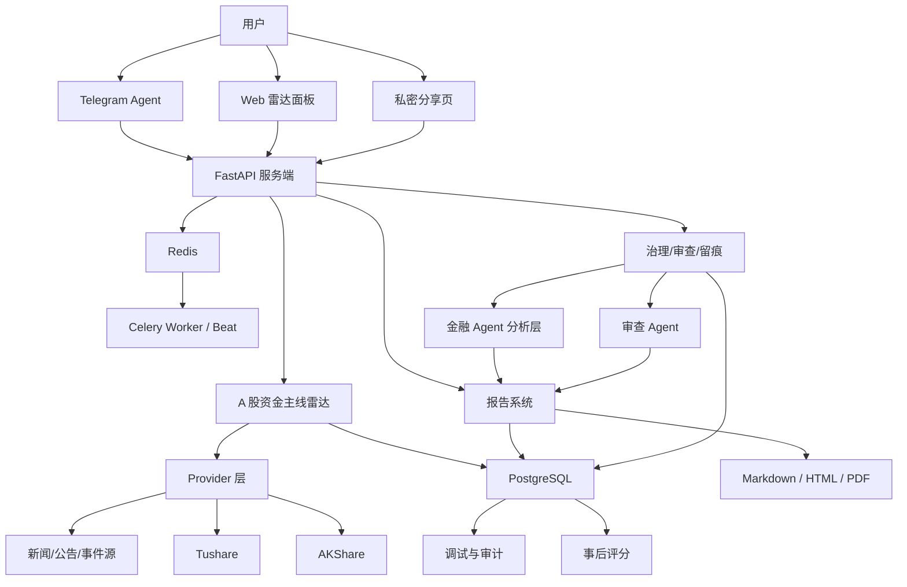

# BaizeFinDB 项目开发总文档

版本：v0.6
更新日期：2026-05-04
状态：M5 A 股 5 分钟资金主线雷达 MVP 验收项完成，进入生产化验证和真实数据增强阶段
适用对象：个人使用、vibe coding 开发、AI 协作接手

## 0. 文档导航

本文件负责记录项目定位、产品边界、技术路线和长期路线图。日常开发请同时阅读：

| 文档 | 用途 |
| --- | --- |
| [docs/README.md](docs/README.md) | 开发文档导航 |
| [docs/PROJECT_STATUS.md](docs/PROJECT_STATUS.md) | 当前阶段和已实现能力 |
| [docs/runbooks/local-dev.md](docs/runbooks/local-dev.md) | 本地开发、Docker、迁移、采集、扫描、故障处理 |
| [docs/api/current-api.md](docs/api/current-api.md) | 当前 API、调用顺序、请求/响应示例 |
| [docs/specs/current-data-model.md](docs/specs/current-data-model.md) | 当前真实数据表和未来规划表边界 |
| [docs/prd/m5-next-step.md](docs/prd/m5-next-step.md) | M5 A 股 5 分钟资金主线雷达 MVP PRD |

## 1. 当前结论

BaizeFinDB 是一个面向个人的 AI 金融雷达与投研辅助系统，不是交易系统，也不是金融终端复刻。

核心形态：

> A 股资金主线雷达 + 事件驱动投研 + 证据链审查 + Telegram/Web 交互 + 日报周报 + 事后评分。

第一版 MVP 是 A 股 5 分钟资金主线雷达。美股后续只做财务、估值、基本面和事件分析，不做 5 分钟资金雷达。

当前技术路线：

- 主工程自建，不 fork FinceptTerminal、OpenBB、FinSight 这类大仓库。
- MVP 用轻量 Python 服务端打底：FastAPI + PostgreSQL + Redis + Celery + Provider 抽象。
- 数据先接 AKShare，Tushare 作为更稳定的补充源。
- AI 负责解释、补证据、审查和生成报告，不直接决定雷达等级。
- edict 的“三省六部制”只吸收治理思想，按金融场景重写轻量版。
- Qlib、Prefect、GraphRAG、Neo4j、完整回测系统都放到 MVP 之后。

截至 2026-05-03，工程已经完成 M1、M2、M3 早期闭环、M4 轻量审查层闭环和 M5 A 股 5 分钟资金主线雷达 MVP 验收项：

- M1：后端工程骨架、配置、健康检查、Alembic、Docker Compose、pytest 已完成。
- M2：AKShare 最小 Provider、采集日志、快照、质量检查、Provider 查询 API 已完成；Tushare Provider 已登记 token 状态和公告/公司/主数据计划端点，其中 `stock_basic`、`anns_d` 和 `stock_company` 已支持手动抓取、失败记录、快照查询和只读准入自检，`anns_d` 中明显重大风险公告可被后续雷达扫描映射为 risk P0。
- M3：雷达扫描批次、候选信号、证据链、P0/P1/P2 初判、生命周期初判已完成。
- M3.2：同一板块/概念的连续扫描记忆、连续 P1 快报候选标记、生命周期转移记录、`golden_cases` 规则样例已完成。
- M3.3：雷达总览 API、按批次查询、当前活跃信号、优先级聚合、生命周期分布、个股回推证据、按板块/概念去重视图和扫描失败状态已完成早期闭环。
- M4：轻量规则审查已完成闭环，可审查单个雷达信号并记录 `approved`、`blocked`、`needs_human_review`；Provider 数据质量、证据冲突、重复触发、来源过期、诱导交易语言正反例、内部分享预检和公开分享 payload 已进入审查判断。
- M5：Celery 5 分钟采集后扫描调度、Telegram/Web/Windows 入口、持仓/自选、quick/standard 报告、日报/周报、1d/3d/5d/10d v2 综合评分、Telegram 折叠推送和基础 Linux 部署骨架已接入；部署预检已支持只读 M5 smoke check、`/ops/overview` 运行状态契约、`/ops/history` 运维历史契约和 `/ops/readiness` 就绪自检契约，Windows 客户端首次使用 smoke check 已支持打开 GUI 前验证 Tkinter import、核心健康、OPS readiness 和非变更只读端点，并可写出脱敏有界 JSON；运行采样脚本已能对部署后的 API 做短窗口连续只读验证，本机 Docker Desktop server overlay 已完成 API/worker/beat 启动和 runtime ready 演练，Web/Windows/Telegram 已展示该运行状态、服务端磁盘/CPU/内存资源摘要、运维历史、运行就绪自检和告警摘要；涨停/跌停/炸板池情绪摘要已进入雷达扫描 summary、主线信号 metrics，并在 Web/Telegram/Windows 雷达总览展示；主线 P0 已锁定不能只由新闻触发，风险 P0 可由重大风险事件单独触发；Review Agent 已区分信号候选审查范围和报告发布前审查；模型失败降级审计已落 `model_call_logs`，默认不保存完整 raw prompt；deep 报告类型已预留但禁止通过 `/reports/from-signal` 创建；Telegram/Web/Windows 只展示后端雷达、情绪、运行状态和评分结果，不重新计算雷达等级或评分；持仓/自选写入已有测试锁定为不改变市场级雷达总览。
- Web OPS 面板、Windows 客户端和 Telegram `/tushare` 已展示 Tushare token 状态、手动抓取启用状态和已实现端点数；`/providers/tushare/readiness`、Web 数据源状态卡片、Windows“数据源自检”按钮和 Telegram `/tushare_ready` 已展示 token、端点、最近抓取、数据质量准入状态和 `anns_d` Beat 开关策略。所有这些入口只读，不触发真实抓取或调度。

下一阶段不是继续铺入口，而是进入生产化验证和真实数据增强：先把现有雷达闭环在 Docker / Linux 服务器上稳定跑起来；`/ops/overview`、`/ops/history`、`/ops/readiness` 和 `infra/scripts/server_runtime_check.py` 已作为第一层只读运行状态、服务端磁盘/CPU/内存摘要、运维历史、运行就绪自检、短窗口运行采样和告警汇总，后续再接更可靠的数据源、趋势图、真实监控告警和真实反馈调参。

一句话：先做一个可运行、可审查、可复盘的个人金融雷达服务，不要一开始背上金融终端、量化平台、交易框架的重量。

## 2. 产品边界

### 2.1 要解决的问题

系统帮助用户更快发现：

- A 股市场资金主线；
- 板块、概念、主题异动；
- 龙头、容量票、连板梯队变化；
- 新闻、政策、公告、产业事件催化；
- 持仓和自选可能受到的影响；
- 风险事件和退潮信号；
- 事后判断是否有效。

MVP 扫描同时看板块/主题/概念和个股异动回推，但板块/主题/概念权重大于单票。单票异动主要用于反推主线、产业链、概念共振或风险事件。

系统输出的是投研辅助信息：

- 观察建议；
- 关注优先级；
- 条件性轻度建议；
- 风险提示；
- 后续确认条件；
- 无效条件；
- 证据链；
- AI 分歧意见；
- 事后评分。

### 2.2 第一阶段不做

- 自动交易、自动下单、券商交易权限接入；
- 保存券商交易密码；
- 秒级高频盘口和高频交易；
- 强买卖指令和保证收益类结论；
- 复杂多租户 SaaS；
- 全量研报库；
- 完整产业链知识图谱；
- 完整历史回测系统；
- 全市场全股票深度分析。

禁止输出这些口径：

- 必涨；
- 必买；
- 稳赚；
- 满仓；
- 无脑上；
- 保证收益；
- 照单交易。

默认免责声明：

> 系统内容仅供个人研究和复盘，不构成投资建议，不保证收益，用户需要自行决策并承担风险。

## 3. 产品原则

### 3.1 规则定级

雷达等级由规则引擎判定。AI 可以解释、补证据、指出风险、建议关注等级，但不能绕过规则直接把信号定成 P0/P1/P2。

P0/P1/P2 是系统固定标准。主线 P0 不能只由新闻触发，必须有资金、板块联动或市场情绪确认；风险 P0 可以由重大公告、监管或黑天鹅单独触发。

强度等级和生命周期分离。强度等级回答“当前重要性”，生命周期回答“主线阶段”；AI 不能用解释结果覆盖规则定级。

### 3.2 证据优先

每个信号必须能回答：

- 为什么触发；
- 数据来自哪里；
- 哪个规则触发；
- 哪个 Agent 参与；
- 审查为什么通过、降级或封驳；
- 为什么推送或没推送；
- 事后表现如何。

### 3.3 审查兜底

以下内容必须经过审查：

- P0 信号；
- 连续 P1 信号；
- 风险信号；
- 持仓/自选相关信号；
- 即将发布的报告；
- 公开分享页。

MVP 的 Review Agent 只审查 P0、P1 快报候选、risk、holding/watchlist 相关候选，以及所有发布前报告。审查可以阻断或要求人工复核，但不能替代规则引擎重新定级。

审查 Agent 只能用硬理由阻止自动发布：

- 数据异常；
- 证据冲突；
- 来源过期；
- 映射错误；
- 重复触发；
- 规则矛盾；
- 保证性结论；
- 诱导交易语言；
- 分享页未脱敏或未脱源。

### 3.4 先闭环，后增强

MVP 优先跑通这个闭环：

1. 数据采集；
2. A 股 5 分钟资金主线雷达扫描；
3. 板块/概念主线和个股异动回推；
4. P0/P1/P2 规则定级和生命周期记录；
5. P0/P1/risk/holding 审查；
6. Telegram 折叠推送；
7. quick/standard 报告生成；
8. Web 雷达总览、信号详情、持仓/自选、报告列表；
9. 日报周报；
10. 1d/3d/5d/10d 事后评分；
11. 调试复盘。

## 4. 技术路线

### 4.1 推荐技术栈

| 层级 | 推荐选择 | 说明 |
| --- | --- | --- |
| 后端 | Python + FastAPI | 轻量，适合 API 和 Agent 工具化 |
| 数据校验 | Pydantic v2 | 统一请求、响应、Provider、Agent 输出结构 |
| 数据库 | PostgreSQL | 存信号、证据、报告、日志、评分 |
| ORM/迁移 | SQLAlchemy 2.0 + Alembic | 稳定，迁移清楚 |
| 缓存/队列 | Redis | Celery broker/result、短期状态、去重 |
| 后台任务 | Celery + Celery Beat | 定时扫描、报告任务、推送任务 |
| 前端 | Next.js + TypeScript | Web 雷达面板、信号详情、报告页、分享页 |
| 样式 | Tailwind CSS + 组件库 | 快速做可用后台界面 |
| 数据源 | AKShare + Tushare | A 股 MVP 数据底座 |
| 报告 | Markdown/HTML 优先 | PDF 和 Quarto 放到后面 |
| 部署 | Docker Compose | 适合个人服务器 |
| LLM | 结构化工具调用 + 模型路由 | 先自建轻量 Agent 编排 |

MVP 数据底座只要求 PostgreSQL + Redis。vector DB、pgvector、Qdrant、GraphRAG、Neo4j 都后置，不能成为 M5 的前置依赖。

### 4.2 建议目录

```text
backend/
  app/
    api/
    core/
    db/
    providers/
    radar/
    evidence/
    agents/
    governance/
    reports/
    telegram/
    portfolios/
    scoring/
    tasks/
    audit/
    debug/
frontend/
  app/
  components/
  lib/
  styles/
infra/
  docker/
  scripts/
docs/
  decisions/
  runbooks/
  specs/
```

### 4.3 总体架构


```mermaid
flowchart TD
  U["用户"] --> TG["Telegram Agent"]
  U --> WEB["Web 雷达面板"]
  U --> SHARE["私密分享页"]

  TG --> API["FastAPI 服务端"]
  WEB --> API
  SHARE --> API

  API --> GOV["治理/审查/留痕"]
  API --> RADAR["A 股资金主线雷达"]
  API --> REPORT["报告系统"]

  RADAR --> PROVIDER["Provider 层"]
  PROVIDER --> AK["AKShare"]
  PROVIDER --> TS["Tushare"]
  PROVIDER --> NEWS["新闻/公告/事件源"]

  RADAR --> DB["PostgreSQL"]
  REPORT --> DB
  GOV --> DB
  API --> REDIS["Redis"]
  REDIS --> TASK["Celery Worker / Beat"]

  GOV --> AGENTS["金融 Agent 分析层"]
  GOV --> AUDIT["审查 Agent"]
  AGENTS --> REPORT
  AUDIT --> REPORT

  REPORT --> EXPORT["Markdown / HTML / PDF"]
  DB --> SCORE["事后评分"]
  DB --> DEBUG["调试与审计"]
```

## 5. 核心模块

### 5.1 Provider 层

Provider 层负责把不同数据源变成统一结构，业务逻辑不能直接调用 AKShare 或 Tushare。

第一阶段 Provider：

- `MarketDataProvider`：指数、个股涨跌幅、成交额、换手率；
- `SectorDataProvider`：行业、概念、主题、板块；
- `LimitUpProvider`：涨停、跌停、连板、炸板；
- `NewsProvider`：新闻、快讯、事件；
- `AnnouncementProvider`：公告、监管、交易所公告；
- `FundamentalProvider`：财务、估值、基础资料。

每次拉取记录：

- provider；
- fetch_time；
- source_time；
- success/failure；
- error_message；
- freshness；
- confidence；
- missing_fields；
- raw_snapshot_id；
- normalization_version。

MVP 策略：

1. 先接 AKShare 的最小行情、板块、概念、涨跌幅接口。
2. 每个接口先用脚本验证，再封装 Provider。
3. 原始响应保留 snapshot 或摘要，方便调试。
4. 数据缺失不让系统崩溃，而是打质量标签。
5. Tushare 先预留 token 和 Provider 壳，再补财务/公告。

当前 Tushare 状态：

- `TUSHARE_TOKEN` 已进入配置系统，`/providers/tushare/status` 只返回是否配置，不泄露 token。
- `/providers/tushare/readiness` 已接入只读准入自检，聚合 token、端点实现、默认查询、最近抓取日志、数据质量记录、`anns_d` 风险公告映射状态和显式 Beat 开关；该接口不触发真实抓取，也不会自行启用 Celery 调度。
- `/providers/tushare/endpoints` 已登记 `anns_d`、`stock_company`、`stock_basic` 三个计划端点。
- 当前 `stock_basic` 已 `implemented=true`，可通过 `/providers/tushare/fetch/stock-basic` 手动抓取并写入 Provider 快照、抓取日志和数据质量记录。
- 当前 `anns_d` 已 `implemented=true`，可通过 `/providers/tushare/fetch/announcements` 按公告日期手动抓取并写入 Provider 快照、抓取日志和数据质量记录；明显重大风险公告标题可在后续雷达扫描中映射为 risk P0，普通公告不会生成信号；公告 URL 只能留在内部快照中，不能进入公开分享 payload；`infra/scripts/check_tushare_anns_d_beat_enablement.py` 可在启用 Beat 前输出 JSON checklist，`infra/scripts/verify_tushare_anns_d_preflight.py` 可离线/no-token 校验归一化必需字段、重大风险 P0 样例和普通公告无风险信号样例。
- 当前 `stock_company` 已 `implemented=true`，可通过 `/providers/tushare/fetch/stock-company` 按交易所手动抓取并写入 Provider 快照、抓取日志和数据质量记录。
- Tushare `anns_d` 公告已有独立 Celery Beat 开关，默认 `TUSHARE_ANNS_D_BEAT_ENABLED=false`，不影响 5 分钟 AKShare+雷达主闭环；只有显式设置为 `true` 时才会按 `TUSHARE_ANNS_D_BEAT_INTERVAL_SECONDS` 调度。
- 后续启用 Tushare 调度前，必须先通过 `uv run python infra/scripts/check_tushare_anns_d_beat_enablement.py` 的 JSON checklist 和 `uv run python infra/scripts/verify_tushare_anns_d_preflight.py` 的离线预调度门禁，再补真实 token 验证、积分消耗评估、实时接口字段校验和端到端误报样例；默认 checklist 和离线门禁不能替代真实环境验证。

### 5.2 雷达引擎

雷达每 5 分钟扫描一次，第一版只做 A 股。

扫描权重以板块、主题、概念为主，个股异动为辅。个股异动需要尽量回推到板块、概念、产业链或风险事件，不能因为单票异动直接放大成市场主线。

扫描流程：

1. 创建 `radar_scan_batch`；
2. 拉取板块/概念/个股异动数据；
3. 计算板块联动、资金代理指标和市场情绪；
4. 聚合新闻、公告、政策、产业事件；
5. 生成候选信号；
6. 规则判定 P0/P1/P2；
7. 判定生命周期；
8. 写入证据和信号路径；
9. 触发审查、推送和报告任务。

等级规则：

| 等级 | 含义 | 触发口径 |
| --- | --- | --- |
| P0 | 强主线 / 重大风险 | 主线 P0 不能只由新闻触发，必须有资金、板块联动或市场情绪确认；风险 P0 可以由重大公告、监管或黑天鹅单独触发。 |
| P1 | 疑似点火 / 值得观察 | 有资金或情绪信号，但证据还不完整。连续 2-3 次 P1 或 30 分钟内 3 次 P1 触发快报候选。 |
| P2 | 弱信号 / 记录观察 | 单点异动、新闻待验证、联动不足、数据缺失、噪音概率较高，默认保留 7 天观察。 |

生命周期：

- 点火；
- 发酵；
- 分歧；
- 回流；
- 高潮；
- 退潮；
- 熄火。

持仓和自选只影响个人提醒优先级，不改变市场主线等级。

强度等级和生命周期必须分开保存、分开展示。规则引擎负责 P0/P1/P2，AI 只解释、补证据、指出风险和提示分歧。

### 5.3 证据链与分享安全

证据字段：

- evidence_id；
- signal_id；
- evidence_type；
- source_name；
- source_url；
- source_time；
- collected_at；
- raw_excerpt；
- normalized_summary；
- confidence；
- freshness；
- copyright_visibility；
- public_share_policy。

分享页默认私密。公开分享页必须脱源、脱敏：

- 不展示原始 URL；
- 不展示源网站域名；
- 不展示大段原文；
- 不展示持仓、成本价、仓位、个人备注；
- 不展示模型审查日志；
- 不展示内部证据链。
- 不展示内部审查 ID、阻断原因、脱敏日志；
- 不展示原始 evidence_type、freshness、精确 confidence、source_time。

M4 已区分两个分享接口：

- `GET /radar/signals/{signal_id}/share-preview`：内部预检接口，给系统和调试后台查看审查状态、阻断原因和脱敏记录。
- `GET /radar/signals/{signal_id}/share-payload`：公开分享 payload，只在规则审查通过且分享策略安全时返回，字段只保留标题、摘要、标的名称、公开优先级标签、生命周期标签、证据摘要标签和免责声明。

### 5.4 Agent 分析层

Agent 不决定雷达等级，只做解释和补充判断。

第一阶段 Agent：

- 市场数据分析员；
- 新闻/事件分析员；
- 基本面分析员；
- 行业/产业分析员；
- 多头研究员；
- 空头研究员；
- 风险评审员；
- 报告撰写员；
- 审查/封驳员。

Agent 输出必须结构化：

- summary；
- supporting_evidence；
- conflicting_evidence；
- risks；
- missing_data；
- suggested_attention_level；
- confidence；
- needs_human_review。

建议等级使用非交易口径：

- 重点关注；
- 继续观察；
- 谨慎跟踪；
- 暂不关注；
- 风险回避。

模型调用可以路由，有主模型和 fallback。模型失败必须显式降级并留痕，不能静默跳过或伪造 AI 结论。模型审计日志默认不保存完整 raw prompt，只有 debug 模式才保存完整上下文。

### 5.5 治理层

治理层的目标是限制 Agent 权力，让每个动作可追溯。

| 治理职责 | 对应功能 |
| --- | --- |
| 规划 | 任务拆解、选择 Agent、选择工具 |
| 执行 | 调度 Provider、Agent、报告、推送 |
| 审查 | 检查证据、风险、诱导交易、版权 |
| 封驳 | 阻止不合格报告或降级信号 |
| 权限 | 区分低风险查询和高风险操作 |
| 审计 | 记录模型调用、工具调用、用户操作 |
| 留痕 | 每个信号、报告、推送都有可追溯路径 |

第一阶段用轻量状态机即可：

```text
created -> planned -> executed -> reviewed -> approved
                                      -> downgraded
                                      -> blocked
                                      -> needs_human_review
```

### 5.6 Telegram 与 Web

Telegram 是雷达消费入口，MVP 支持：

- 查询当前雷达；
- 查询 P0/P1/P2；
- 查询板块信号路径；
- 查看 P0 快速提醒和 P1 快报候选；
- 添加临时关注、自选；
- 查询持仓影响；
- 查询日报、周报、审查结果；
- 获取报告链接。

推送规则：

- P0 先发 Telegram 快速提醒，后台自动生成标准报告；
- P1 连续 2-3 次触发，或 30 分钟内 3 次触发，生成快报候选；
- P2 不刷屏，保留 7 天观察；
- Telegram 推送按 P0/P1/P2 折叠汇总，不按单条信号刷屏；
- Web/Telegram/Windows 只消费后端结果和发命令，不在入口层重算雷达等级、运行状态、数据源状态或评分。

高风险或高成本操作必须二次确认：

- 删除关注对象；
- 修改持仓成本或仓位比例；
- 关闭提醒；
- 批量操作；
- 触发高成本深度报告；
- 公开分享报告；
- 导出含个人数据的报告。

Telegram free-chat Agent 可以修改低风险个人数据，例如添加临时关注、备注或自选；高风险操作必须二次确认。

Web MVP 页面：

- 雷达总览页；
- 信号详情页；
- 持仓/自选管理页；
- 报告列表页；

以上是第一批页面顺序。报告详情、私密分享页、调试/审计后台可以后置，不能挤占雷达总览和信号详情。

### 5.7 报告与评分

报告分三档：

- quick：快速说明单个 P0/P1/risk/holding 相关信号；
- standard：P0 自动报告默认档，包含证据、分歧、风险和后续观察条件；
- deep：用户手动触发，MVP 不自动生成。

自动生成最多到 quick 和 standard。deep 必须手动触发，并做二次确认。

自动生成：

- 日报；
- 周报；
- 事后评分报告；
- 分享页版本。

事后评分窗口固定为 1d、3d、5d、10d。评分是综合评分，不只看涨跌幅，应综合主线延续性、板块联动、风险验证、证据质量、提醒及时性和后续走势。

MVP 路线：

1. 先用 Markdown 模板生成快报和标准报告。
2. 再用 HTML 页面展示报告。
3. PDF 导出可先用浏览器打印，Quarto 后置。
4. 深度报告先预留字段和手动入口，不急着上全量研报库。

## 6. 数据模型 MVP

注意：本节包含当前真实表和未来规划表。当前已实现的数据表以 `docs/specs/current-data-model.md` 为准；未进入迁移的表只能作为路线图，不要在开发中假设它们已经存在。

核心数据表：

| 类别 | 表 |
| --- | --- |
| 用户与入口 | users、telegram_bindings |
| 标的与板块 | instruments、sectors、concepts |
| 数据采集 | market_snapshots、provider_fetch_logs、data_quality_checks |
| 雷达信号 | radar_scan_batches、radar_signals、radar_signal_reviews、signal_lifecycle_events |
| 证据链 | signal_evidences、evidence_items |
| 个人关注 | portfolios、watchlists、focus_items |
| 报告 | reports、report_exports、report_reviews |
| Agent 与工具日志 | model_call_logs、agent_task_logs、tool_call_logs |
| 推送与审计 | push_logs、audit_events |
| 复盘评分 | score_records |
| 调试 | debug_cases |

MVP 是单用户/白名单模式：雷达主数据共享，持仓、自选、报告、Telegram 会话、导出和分享按用户隔离。持仓成本价和仓位比例可选，不得影响市场主线等级。

核心信号字段：

- signal_id；
- scan_batch_id；
- market；
- sector/theme/concept；
- related_instruments；
- rule_level；
- ai_suggested_level；
- lifecycle_stage；
- trigger_rules；
- evidence_summary；
- data_quality；
- source_time；
- detected_at；
- is_portfolio_related；
- is_watchlist_related；
- push_status；
- report_status；
- review_status。

调试案例模板：

```text
debug_case_id:
问题类型:
发现时间:
关联 signal_id / report_id / task_id:
现象:
期望:
实际:
数据源状态:
触发规则:
Agent 输出:
审查结论:
根因:
修复方案:
回归测试:
是否写入文档/规则:
```

## 7. 开源项目取舍

正式引入代码前必须重新核对许可证、README、依赖和最新提交。

| 项目 | 当前判断 |
| --- | --- |
| AKShare | 可作为第一数据源，注意稳定性和数据质量标记。 |
| Tushare | 可作为补充数据源，token、权限和收费单独管理。 |
| OpenBB | 不作为底座，只学习 Provider、SDK、插件化、MCP 思路；核心代码不要复制。 |
| FinceptTerminal | 不作为底座，只参考终端体验；不要复制 UI trade dress 或核心代码。 |
| FinSight | 不直接引代码，只参考报告流水线。 |
| TradingAgents | 可参考角色分工和辩论流程，但交易口径必须改成观察/风险/证据不足。 |
| FinRobot | 可参考报告、估值、财务分析思路，不能继承交易策略口径。 |
| edict | 可吸收治理思想，建议按金融场景重写轻量版。 |
| Docling / Quarto | 报告解析和导出阶段再接入。 |
| Qlib / GraphRAG / Neo4j / vectorbt / backtrader | 不进 MVP，避免项目变成量化回测或图谱平台。 |

许可证原则：

- MIT / Apache-2.0 项目可以优先评估直接依赖或隔离吸收。
- AGPL / GPL 项目只参考思路，不复制核心代码。
- 涉及交易、券商接入、HFT 的能力不进入第一阶段。

## 8. MVP 路线

按个人 vibe coding 节奏推进，不按自然周死卡。每一阶段只追求可验收闭环。

| 阶段 | 目标 | 完成标准 |
| --- | --- | --- |
| M1 工程骨架 | 搭出可启动的最小服务端 | 已完成：FastAPI、PostgreSQL、Redis、Alembic、Docker Compose、`GET /health`、pytest 冒烟测试可用。 |
| M2 数据底座 | AKShare Provider 跑通 | 已完成早期闭环：行情/板块/概念数据可拉取、入库、记录质量标签；失败不拖垮主服务；Tushare `stock_basic`、`anns_d` 和 `stock_company` 已支持手动抓取、失败记录、日志和快照查询，`anns_d` 中明显重大风险公告可被后续雷达扫描映射为 risk P0；`anns_d` Beat 调度具备默认关闭的显式开关。 |
| M3 雷达核心 | 生成 P0/P1/P2 信号和生命周期 | 已完成早期闭环：每次扫描可生成候选信号，能追溯数据批次、规则和证据，并记录连续扫描变化、总览视图和普通失败状态。 |
| M4 审查 Agent | 高优先级信号和报告发布前有审查 | 已完成：单个信号可通过轻量规则审查，P0、连续 P1、诱导交易语言正反例、证据缺失、低置信度证据、失败/降级数据质量、证据冲突、重复触发、来源过期、内部分享预检和公开分享 payload 都能被处理并留痕。 |
| M5 A 股 5 分钟资金主线雷达 MVP | 雷达主线闭环可日常使用 | 5 分钟扫描、板块/概念优先、个股异动回推、P0/P1/P2 和生命周期分离、P0/P1/risk/holding 审查、Telegram 折叠推送、quick/standard 报告、Web 四页、持仓自选、日报周报和 1/3/5/10 日评分可用。 |
| M6 报告和 Agent 增强 | 在 M5 闭环上增强深度分析 | 增强报告模板、deep 手动报告、模型路由、fallback、调试案例和更完整的 Agent 分工。 |
| M7 Web 和分享增强 | 提升复盘与展示体验 | 增加报告详情、私密分享页、调试/审计后台和更细的交互，不改变后端雷达定级。 |
| M8 数据和复盘增强 | 系统开始用评分反馈调规则 | 扩展评分维度、黄金样例和调参闭环，必要时再评估 pgvector/Qdrant/GraphRAG。 |

已完成的工程节点：

1. 创建后端 MVP 骨架。
2. 建立 PostgreSQL、Redis、Alembic、健康检查。
3. 验证 AKShare 最小数据接口。
4. 写 Provider 抽象和拉取日志。
5. 建立 5 分钟采集任务。
6. 建立 Provider 状态、日志、快照查询 API。
7. 建立雷达扫描批次、候选信号、证据链基础表。
8. 建立 P0/P1/P2 初判、生命周期初判、连续 P1 快报候选标记。
9. 建立雷达总览 API、按批次查询和扫描失败状态。
10. 建立轻量规则审查 API、审查记录表和基础拦截规则。
11. 将 Provider 数据质量摘要带入雷达 summary、信号证据和审查判断，并补充 M4 审查黄金样例。
12. 建立内部分享预检安全门，未通过审查或分享策略不安全时阻断发布预览。
13. 建立公开分享 payload，只输出脱源脱敏摘要和公开标签，不泄露内部审查字段、原始来源、精确置信度或来源时间。
14. 建立 Tushare Provider 预留壳，暴露 token 配置状态和计划端点。
15. 建立 Tushare `stock_basic` 手动抓取、标准化入库、失败记录、日志和快照查询，并补充不写库验证脚本和写库采集脚本。
16. 建立 Tushare `anns_d` 公告手动抓取、标准化入库、失败记录、日志和快照查询，并补充不写库验证脚本、写库采集脚本、离线预调度校验和默认关闭的 Celery Beat 开关。
17. 建立 Tushare `stock_company` 公司信息手动抓取、标准化入库、失败记录、日志和快照查询，并补充不写库验证脚本和写库采集脚本；暂不接入调度。
18. 将 Tushare 状态接入 Web OPS 面板，前端只读展示 token 配置和端点实现状态，不触发抓取。
19. 将 Tushare 状态接入 Windows 客户端，桌面端只读展示 token 配置、手动抓取启用状态和端点实现状态，不触发抓取。
20. 将 Tushare 状态接入 Telegram `/tushare` 命令，Bot 只读展示 token 配置、手动抓取启用状态和端点实现状态，不触发抓取。
21. 将 Tushare 准入自检接入 `/providers/tushare/readiness`、Web、Windows 和 Telegram `/tushare_ready`，只读展示 token、端点、最近抓取和数据质量准入状态，不触发真实抓取或调度。
22. 将 Tushare `anns_d` 中明显重大风险公告接入雷达 risk P0 轻量映射；普通公告不生成信号，抓取阶段仍不直接生成风险信号。
23. 将 `/ops/overview` 扩展为只读告警摘要，Web/Telegram/Windows 同步展示扫描停滞、失败率和 unhealthy 计数告警。
24. 将 `/ops/overview` 扩展为服务端运行资源摘要，返回 API 进程运行时长、Python/平台摘要、磁盘可用空间、CPU 使用率和内存使用率；Web/Telegram/Windows、部署 smoke check 和文档同步更新。
25. 新增 `/ops/history` 只读运维历史接口，汇总最近扫描、Provider 异常、数据质量异常、Telegram 推送异常、模型降级/失败事件；Web、Telegram `/ops_history`、Windows 客户端、部署 smoke check 和文档同步更新。
26. 新增 `/ops/readiness` 只读运行就绪自检，基于服务端磁盘/CPU/内存、雷达新鲜度、扫描失败率、Provider、数据质量、Telegram 推送和模型调用给出 `ready`、`warning` 或 `blocked`；Web、Telegram `/ops_ready`、Windows 客户端、部署 smoke check 和文档同步更新。
27. 新增 `infra/scripts/server_runtime_check.py` 运行采样脚本，连续读取健康检查、Ops 运行状态、运维历史和运行就绪自检；接口失败或 readiness `blocked` 返回失败退出码，warning 默认记录为告警，可用 `--fail-on-warning` 升级为失败。
28. 新增 `infra/scripts/export_ops_evidence.py` OPS evidence 导出脚本，默认只读 GET `/health`、`/health/ready`、`/ops/overview`、`/ops/history` 和 `/ops/readiness`，输出递归脱敏和裁剪后的 JSON，用于区分历史 Provider / 数据质量 warning 与真正 blocker；接口读取失败或 readiness `blocked` 非零退出，普通 warning 非阻塞。
29. 完成本机 Docker Desktop server overlay 演练：API 镜像构建、容器迁移、API/worker/beat 启动、M5 smoke check、`pg_dump` 可用性检查和 runtime ready 检查均通过；修复部署预检脚本的 Windows UTF-8 输出处理，并避免打印展开后的 compose environment。
30. 完成 Tushare `anns_d` 可选 Beat 调度的 Docker 演练：最新 API 镜像重建成功，默认容器 schedule 只包含 `baizefindb.radar.collect_and_scan`，一次性 env 覆盖启用时只额外加入 `baizefindb.providers.collect_tushare_announcements`；部署预检、M5 smoke check、手动扫描后 runtime ready 检查均通过。
31. 新增 Tushare `anns_d` 离线/no-token 预调度校验：本地 golden case 覆盖必需字段、重大风险公告映射 risk P0 和普通公告不生成风险信号，用于启用 `TUSHARE_ANNS_D_BEAT_ENABLED=true` 前的门禁。
32. 新增 Tushare `anns_d` Beat enablement checklist CLI：默认离线/no-token 输出 JSON，汇总 offline sample gate、token、Beat 启停、interval、live verify 和 readiness/live data 状态，避免启用前遗漏必要门禁。

最建议的下一步：

1. 进入 M5 A 股 5 分钟资金主线雷达 MVP，不再按 Telegram、报告、Web 三选一拆分。
2. 先巩固后端雷达规则、调度、状态记录、报告触发、Provider、Agent 流程、DB/证据/审计/日志。
3. Telegram/Web 只消费雷达结果和发命令；报告、日报周报和评分围绕雷达闭环生成。
4. 所有发布类输出都复用 M4 审查和分享预检。
5. 继续根据真实误报补诱导交易词正反例，不急着接复杂 Agent。

M5 详细拆分见 `docs/prd/m5-next-step.md`。默认按雷达优先顺序推进，而不是同时铺入口或把入口作为独立产品线。

不建议现在做：

- fork FinceptTerminal；
- fork OpenBB；
- 上完整 Agent 框架；
- 做完整 Web 大屏；
- 做图谱；
- 做完整回测；
- 接自动交易。

## 9. 测试与质量门禁

### 9.1 测试重点

单元测试覆盖：

- Provider 标准化；
- 数据质量检查；
- P0/P1/P2 判定；
- 生命周期判定；
- 证据去重；
- 报告模板；
- 审查规则；
- 分享页脱敏；
- 权限和二次确认。

集成测试覆盖：

- Provider 拉取到入库；
- 扫描任务到信号生成；
- 信号到审查；
- 审查到推送；
- P0 到快报和标准报告；
- Telegram 到工具调用；
- Web 读取 API；
- 日报周报生成；
- 评分窗口计算。

黄金样例建议放在 `golden_cases`：

- 历史强主线；
- 历史风险事件；
- 新闻催化但资金不确认；
- 资金先行但催化待解释；
- 单票异动误报；
- 板块高潮后退潮；
- 持仓相关风险。

### 9.2 合并门禁

每个阶段合并前至少满足：

- 服务能启动；
- 数据库迁移可执行；
- 关键测试通过；
- 无密钥泄漏；
- 新增数据表有迁移；
- 新增后台任务有失败重试；
- 新增 Agent 输出有日志；
- 新增报告模板有审查规则；
- 新增公开展示有脱敏脱源检查；
- 相关文档已更新。

### 9.3 模块级 git 版本管理

这是长期开发约束，适用于后续人工开发和 AI 协作。

后续 AI 协作默认策略：模块设计或开发阶段完成后，AI 自动完成 git commit，不再每次向用户确认；但不自动 push，除非用户明确要求推送。

不要求无边界的零散编辑都提交；但即使是小的模块化更新，只要形成明确阶段边界，也要同步更新相关开发文档并提交 git commit。

提交前必须执行：

1. 跑对应质量检查，例如 `uv run pytest`、`uv run ruff check .`、`uv run alembic heads`、`uv run alembic upgrade head --sql`，按本次模块实际影响选择。
2. 查看 `git status`，确认变更范围清楚。
3. 检查 staged 文件，确认没有把 `.env`、密钥、个人数据、原始付费数据、持仓截图、报告导出等敏感文件加入提交。
4. 如发现未识别的脏文件或疑似用户手工改动，不能自动纳入提交；要把它们和本次模块变更隔离，并在交付说明中明确列出。

commit 仍按模块边界拆分，不把多个无关模块混成一个大提交。commit message 必须能看懂模块和动作，例如：

- `docs(prd): refine radar mvp`
- `feat(radar): add scan scheduler`
- `test(radar): cover p1 continuity`
- `docs(dev): add git workflow`

文档、迁移、测试和代码要随模块一起提交；如果只完成设计文档，也要提交文档版本。大模块按阶段拆分提交：

1. 设计文档 commit；
2. 数据模型/迁移 commit；
3. 业务实现 commit；
4. 测试/文档 commit。

## 10. 部署、运维与安全

目标环境：Linux 服务器。

核心服务：

- API 服务；
- PostgreSQL；
- Redis；
- Celery Worker；
- Celery Beat；
- Telegram Bot；
- Web 前端；
- 文件/报告存储；
- 日志目录。

健康检查：

- API 存活；
- 数据库连接；
- Redis 连接；
- Celery Worker；
- 定时任务是否运行；
- 上一次雷达扫描时间；
- Provider 上一次成功时间；
- Telegram 推送成功率；
- 模型调用失败率；
- 报告生成失败率。

备份与安全：

- PostgreSQL 每日备份；
- 报告文件定期备份；
- `.env` 不进仓库；
- 原始付费数据和个人持仓截图不进仓库；
- LLM API key、Telegram Bot Token、Tushare token、数据库密码只放环境变量或服务器密钥管理。

默认不保存完整 prompt 和全部上下文。只有调试模式才保存完整上下文。

## 11. 风险清单

| 风险 | 影响 | 应对 |
| --- | --- | --- |
| AKShare 接口不稳定 | 漏报、误报、扫描失败 | Provider 日志、数据质量标记、Tushare 补充 |
| 规则过度敏感 | P1/P2 噪音多 | 黄金样例和事后评分调参 |
| AI 幻觉 | 报告误导 | 证据链输入、审查 Agent、禁止无来源结论 |
| 许可证污染 | 后续代码风险 | AGPL/GPL 仓库只参考，不复制 |
| 系统过重 | MVP 拖不出来 | Qlib、GraphRAG、Prefect、Neo4j 后置 |
| 自动交易边界模糊 | 合规风险 | 不接券商交易，不输出强买卖指令 |
| 分享页泄露 | 隐私/版权风险 | 脱敏、脱源、分享审查 |
| 数据版权 | 公开内容风险 | 不展示原始 URL、域名、大段原文 |

## 12. AI 协作开发约定

用户是业余开发者，使用 vibe coding 开发，不需要过多解释技术细节。

后续 AI 接手时应该：

- 先读本文件；
- 先做可运行小闭环；
- 每次只推进一个明确模块；
- 不引入重型框架来显得高级；
- 不复制 AGPL/GPL 项目代码；
- 任何新数据表都加迁移；
- 任何新后台任务都加日志和失败处理；
- 任何报告输出都走审查；
- 任何公开分享都做脱敏脱源；
- 每完成一个模块设计或开发阶段，先跑对应质量检查，再查看 `git status`，按模块边界提交独立 git commit；
- 后续 AI 协作默认自动 commit，不再每次询问用户确认；不自动 push；
- 即使是小的模块化更新，只要形成明确阶段边界，也要同步更新相关开发文档并提交；
- 提交前检查 staged 文件，确认 `.env`、密钥、个人数据、原始付费数据、持仓截图、报告导出等敏感文件没有被纳入提交；
- 文档、迁移、测试和代码随模块一起提交；只完成设计文档时，也要提交文档版本；
- 未识别脏文件或疑似用户手工改动不能自动纳入提交，要隔离并说明；
- 技术解释保持够用即可。
